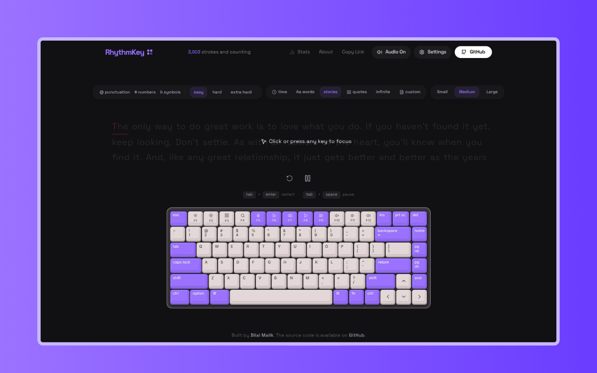

<h1 align="center">RhythmKey</h1>

*<p align="center"> A sleek, open-source typing test application that combines performance tracking, customizable settings, and a distraction-free interface to help you type faster and more accurately. </p>*

<p align="center">


</p>

<p align="center">
  <a href="https://rhythmkey.vercel.app/"><b style="color:#9B72FF">Live Demo</b></a> &nbsp;•&nbsp;
  <a href="https://github.com/byllzz/rhythmkey/issues/new?labels=bug&template=bug-report---.md"><b style="color:#9B72FF">Report Bug</b></a> &nbsp;•&nbsp;
  <a href="https://github.com/byllzz/rhythmkey/issues/new?labels=enhancement&template=feature-request---.md"><b style="color:#9B72FF">Request Feature</b></a>
</p>

<br>


# About RhythmKey

Welcome to **RhythmKey** - a modern, open-source typing test application built to deliver a smooth, customizable, and motivating typing experience directly in your browser.

Unlike traditional typing tests, RhythmKey offers **multiple test modes**, **live statistics**, and a **fully adjustable interface** that adapts to your preferences. Whether you're a beginner looking to build muscle memory or a pro aiming for speed, RhythmKey provides the tools you need to track your progress and push your limits.

## Why RhythmKey?

| Feature | Highlights |
|---------|------------|
| **Typing Modes** | **Time** (15/30/60/120s) • **Words** (10/25/50/100) • **Stories** (S/M/L) • **Quotes** • **Infinite** • **Custom** |
| **Live Tracking** | Real-time **WPM**, **Accuracy**, and progress indicator |
| **Typing Experience** | Space Grotesk • Smooth cursor • Error highlighting • Next-word preview |
| **Customization** | Themes (Dark/Light/System) • Keyboard Layouts (QWERTY/AZERTY/DVORAK) • Sound Packs • Cursor Styles • Font Size • Live Stats • And more |
| **Detailed Results** | WPM • Accuracy • Raw WPM • Consistency • Mistakes • Backspaces • Performance Graph • Export (JSON, CSV, MD, PNG, JPG, SVG) |
| **Persistent Data** | Automatically saves settings, statistics, custom text, and keystrokes using `localStorage` |

# RhythmKey Features

## Complete Feature List

| # | Feature | Description |
|---|---------|-------------|
| 01 | **Multiple Typing Modes** | Time, Words, Stories, Quotes, Infinite, Custom |
| 02 | **Live WPM & Accuracy** | Real-time typing statistics |
| 03 | **Smooth Cursor Animation** | Spring-like cursor movement |
| 04 | **Word-Level Error Highlighting** | Red underline + incorrect character highlighting |
| 05 | **Space Grotesk Font** | Modern readable typeface |
| 06 | **Show Next Word** | Optional next-word preview |
| 07 | **On-Screen Keyboard** | Supports QWERTY, AZERTY, and DVORAK |
| 08 | **Sound Effects** | Click, Mechanical, Typewriter |
| 09 | **Practice Mode** | Prevents incorrect keystrokes |
| 10 | **Themes** | Dark, Light, System |
| 11 | **Custom Settings** | Cursor, font size, timeout, auto-focus, and more |
| 12 | **Results Screen** | Graphs, statistics, exports |
| 13 | **Statistics Page** | History, averages, best scores |
| 14 | **Persistent Storage** | Saves settings and history in localStorage |
| 15 | **Custom Text Mode** | Paste or upload your own text |
| 16 | **Share URLs** | Share current typing configuration |
| 17 | **Keyboard Shortcuts** | Productivity shortcuts |
| 18 | **About Page** | Developer information and credits |

# Usage

| Feature | Details |
|---------|---------|
| **Typing Modes** | Time (15/30/60/120s) • Words (10/25/50/100) • Stories (S/M/L) • Quotes •  Infinite •  Custom |
| **Text Options** | Toggle **Punctuation**, **Numbers**, **Symbols** • Difficulty: **Easy / Hard / Extra Hard** |
| **Live Stats** | WPM • Accuracy • Remaining Time/Words • Progress Indicator • Error Highlighting |
| **Results** | WPM • Accuracy • Raw WPM • Consistency • Mistakes • Backspaces • Performance Graph |
| **Downloads** | JSON • CSV • Markdown • PNG • JPG • SVG |
| **Settings** | Theme • Keyboard • Sounds • Cursor • Font Size • Live Stats • Next Word • Language • Idle Timeout • Auto Focus |
| **Statistics** | Total Tests • Avg WPM • Best WPM • Avg Accuracy • History |
| **Custom Text** | Paste Text • Upload `.txt`, `.md`, `.csv`, `.json` • Preview • Trim |
| **Share** | Copy the current test configuration URL |
| **Shortcuts** | `Ctrl+K` Settings • `Ctrl+S` Stats • `Tab+Space` Pause • `Tab+Enter` Restart |

# Architecture & Folder Structure

| File | Description |
|------|-------------|
| `index.html` | Main entry point |
| `src/` | Application source code |
| `src/pages/` | Main, Stats, About, NotFound |
| `src/components/` | Reusable UI components |
| `src/hooks/` | Custom React hooks |
| `src/utils/` | Helper utilities |
| `src/sounds/` | Sounds Used in Keyboard |
| `src/data/` | Word lists, stories, quotes |
| `public/` | Static assets |
| `package.json` | Dependencies and scripts |


# Built With

<details open>
<summary><strong> RhythmKey is built using the following technologies</strong></summary>

- **React** - UI library
- **Vite** - Fast development & build tool
- **Tailwind CSS** - Utility-first CSS framework
- **React Router** - Client-side routing
- **Lucide React** - Modern icon library
- **React Icons** - Additional icon collection

</details>

<p align="left">
  

</p>

# Getting Started

## Requirements

- npm or Yarn
- Modern browser (Chrome, Firefox, Edge, Safari)

## Installation

```bash
# Clone repository
git clone https://github.com/byllzz/rhythmkey.git

# Enter directory
cd rhythmkey

# Install dependencies
npm install

# Start development server
npm run dev
```

# Show Your Support

If you like RhythmKey:

- Star the repository
- Fork the project
- Report issues
- Suggest improvements
- Contribute

Every contribution helps make RhythmKey better.

# Contributors

A huge thank you to everyone who has contributed to RhythmKey!

<a href="https://github.com/byllzz/rhythmkey/graphs/contributors">
  
</a>

<p align="right">
<a href="#rhythmkey">⬆ Back to Top</a>
</p>


## Author


### Bilal Malik (byllzz)
<p align="left">

[](https://github.com/byllzz)
[](https://x.com/bilalmlkdev)
[](https://bilalmlkdev.vercel.app)
[](https://www.linkedin.com/in/bilalmlkdev/)
[](mailto:bilalmlkdev@gmail.com)


</p>

<p align="left">
If you enjoyed this project, consider giving it a ⭐ on GitHub!
</p>

# License (MIT)

This project is licensed under the **MIT License**.

```text
MIT License

Copyright (c) 2026 Bilal Malik

Permission is hereby granted, free of charge, to any person obtaining a copy
of this software and associated documentation files (the "Software"), to deal
in the Software without restriction, including without limitation the rights
to use, copy, modify, merge, publish, distribute, sublicense, and/or sell
copies of the Software.

The above copyright notice and this permission notice shall be included in all
copies or substantial portions of the Software.

THE SOFTWARE IS PROVIDED "AS IS", WITHOUT WARRANTY OF ANY KIND, EXPRESS OR
IMPLIED, INCLUDING BUT NOT LIMITED TO THE WARRANTIES OF MERCHANTABILITY,
FITNESS FOR A PARTICULAR PURPOSE AND NONINFRINGEMENT. IN NO EVENT SHALL THE
AUTHORS OR COPYRIGHT HOLDERS BE LIABLE FOR ANY CLAIM, DAMAGES OR OTHER
LIABILITY, WHETHER IN AN ACTION OF CONTRACT, TORT OR OTHERWISE, ARISING FROM,
OUT OF OR IN CONNECTION WITH THE SOFTWARE OR THE USE OR OTHER DEALINGS IN THE
SOFTWARE.
```
© 2026 RhythmKey. Licensed under the MIT License.
